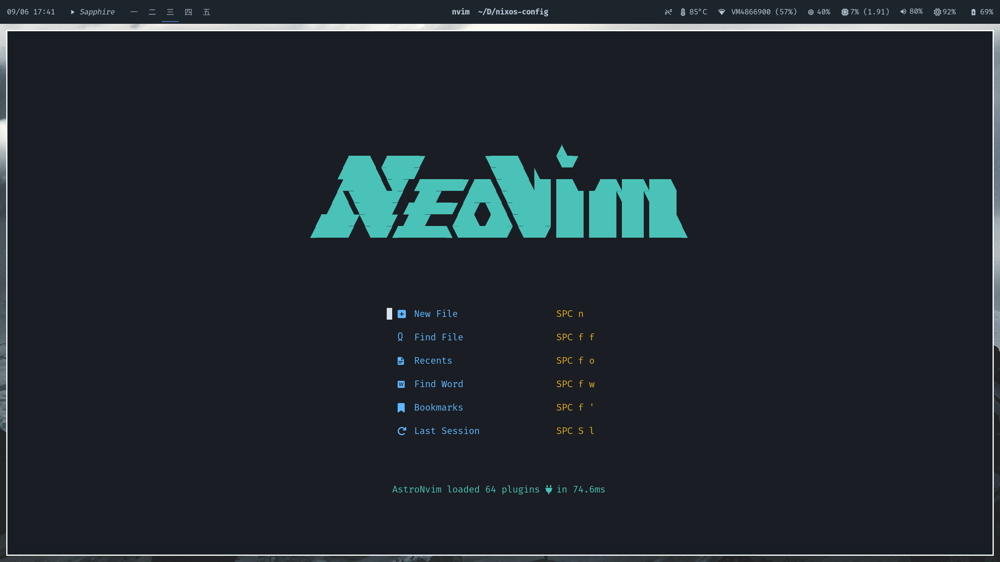

# NixOS config.

NixOS configuration files. WIP.

Massive props to @Misterio77, his packages, example configurations, and personal configurations have been a huge help in getting this setup.

## Structure

- `flake.nix`: Main flake that references all host and home configurations. Bootstrap with nix develop to add decessary packages to path for setup.
- `hosts`
  - Host configurations. Each host has a configuration file that is referenced in the flake.
  - Each device can opt in or out of features: such as users, home-manager, etc.
  - `common`
    - `global`: Configuration options that are shared between all hosts.
    - `optional`: Optional configuration options.
  - `slaptop`: Personal laptop config
  - `velocity`: Stripped down server configuration. Used mainly for home lab stuff.
  - `iso`: A "machine" that is used to build custom iso images.
- `home-manager`
  - `common`
    - `global`: Global home manager config
    - `optional`: Optional home manager config files
  - `sjcobb`: Personal home-manager configuration. Uses most optional configurations.
  - `guest`: Guest home-manager configuration. Quite minimal. Use for gaming as well, so I don't get distracted by work stuff.
- `generators`: Generators for creating custom configurations using nixos-generators. Can be accessed through nix build
  - `formats`
    - `gnome-iso`: configuration for a gnome iso image
    - `plasma-iso`: configuration for a plasma iso image
- `pkgs`: Custom packages. Used to build packages that are not in nixpkgs (or need modification that can't be done through a overlay). Can be accessed as well through nix build
- `overlays`: Custom overlays. Used to add packages to nixpkgs or modify existing packages.
- `modules`: Custom modules. Used to add custom configuration options to nixos. Most of these are not really necessary, but are used to make the configuration more readable.
- `templates`: An attempt at a few custom templates.

## Bootstrapping

To bootstrap the system, run the following command:

```bash
nix develop
```

You should then be able to run the following command to build the system:

```bash
sudo nixos-rebuild switch --flake .#{INSERT_HOST_NAME}
```

```bash
home-manager switch --flake .#{INSERT_USER_NAME}@{INSERT_USER_NAME}
```

### Sops

Currently I don't have GPG or Yubikey setup for this configuration. I am using age for encryption.

To setup age, follow the instructions at: https://github.com/Mic92/sops-nix

If you are using a stripped down version, you shouldn't need to deal with sops. However if you are using the full version, you will need to setup sops.

To do so: add or change `.sops.yaml` to include the following:

```yaml
keys:
  # Users
  - &users:
    - ...
    - &your_user: age1234567890abcdefg
  # Hosts
  - &hosts:
    - ...
    - &your_host: age1234567890abcdefg

creation_rules:
  - path_regex: hosts/slaptop/secrets.ya?ml$
    key_groups:
    - age:
      - ...
      - *your_user

  - path_regex: hosts/common/secrets.ya?ml$
    key_groups:
    - age:
      - ...
      - *your_user
      - *your_host
```

Make sure that you have .config/sops/age/keys.txt setup with the correct keys.

Then run the following command:

```bash
sops hosts/common/secrets.yaml # Or whatever secrets file you want to edit or create
```

## Screenshots




